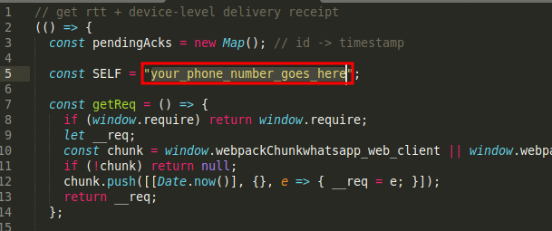

# "Careless Whisper" Proof of Concept

A Python based proof-of-concept for monitoring Round-Trip Time (RTT) of silent reaction delivery receipts in real-time messaging applications(Whatsapp), based on the research presented in [Careless Whisper: Exploiting Silent Delivery Receipts to Monitor Users on Mobile Instant Messengers](https://arxiv.org/abs/2411.11194) paper.

The side-channel attack exploiting silent delivery receipts in WhatsApp and Signal was first documented by Gegenhuber et al. in their 2025 paper *"Careless Whisper: Exploiting Silent Delivery Receipts to Monitor Users on Mobile Instant Messengers."*

## Overview
This proof-of-concept implements the silent delivery receipt RTT monitoring technique described in the paper by injecting a javascript snippet that will monitor for the "message/reaction delivered" packets that whatsapp sent via websockets, the JS snippet will listen post E2EE decryption.  
After hooking the post-descryption "delivered" message the JS will send 500000 reaction to the target message with a 1s interval, and it will start capturing the RTT time.


## 🛠️ Prerequisites
- [uv](https://docs.astral.sh/uv/)
- [Python 3.13+](https://www.python.org/)

## Setup

1. Clone this repository:
```bash
git clone git@github.com:ahnaf505/careless-whisper-poc.git
cd careless-whisper-poc
```

2. Install Python dependencies:
```bash
uv sync
```

3. Edit the message id in [inject.js](https://github.com/ahnaf505/careless-whisper-poc/blob/main/inject.js)  
   read [this section](#how-to-get-the-target-message-id) to obtain message id and configure [inject.js](https://github.com/ahnaf505/careless-whisper-poc/blob/main/inject.js)
4. Add your own phone number in [inject.js](https://github.com/ahnaf505/careless-whisper-poc/blob/main/inject.js)  
   this was used to detect if the message has been received by your own devices(phones, or other Whatsapp Web instance) and prevent false positive "delivered" message  
   The format must be exactly like this: (country code)123456789. For example, an Indonesian number would be written as 628123456789

   

6. Run main.py:
```bash
uv run main.py
```

6. Wait for whatsapp web to finish loading and login using your phone, then press ENTER
7. Wait until you have enough data sample, all of them are automatically saved on the `latency.db`.

## How to get the target message id
1. Login to [WhatsApp Web](https://web.whatsapp.com) on your browser
2. Open the Devtools

   

3. Open the target chat, and choose the message you want to target, this message has to be **sent by you** or else the target will receive a notification everytime the program react to the target message, which essentially defeats the point of silent monitoring  
   For example, in this case, the red rectangle marks the target message

   

4. Use the element selector tool to select the message

   

5. Find and copy the message id
   
   

6. Edit message id in inject.js

   
   
7. Continue with the setup!


