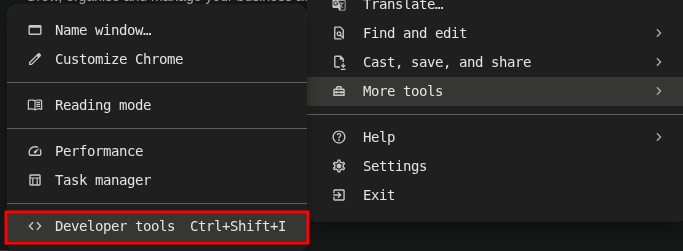
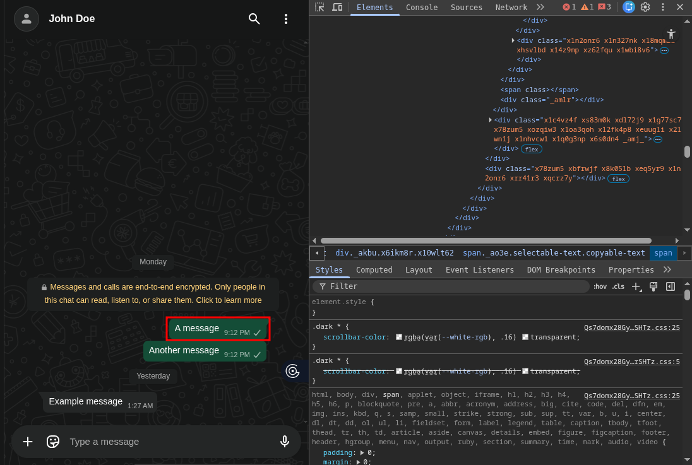
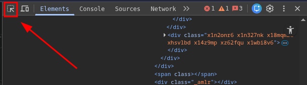
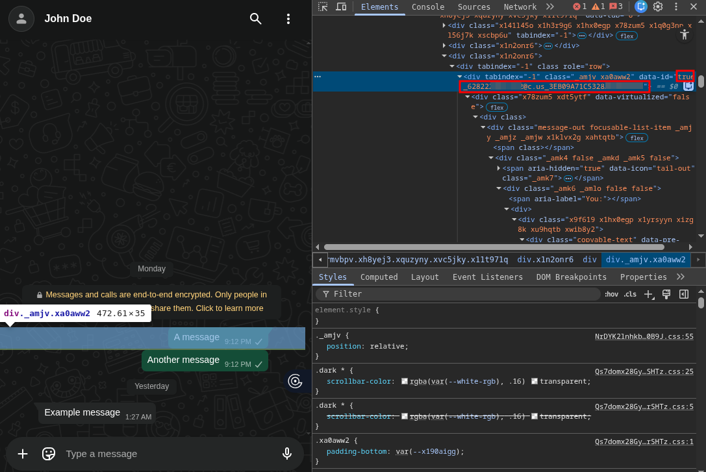
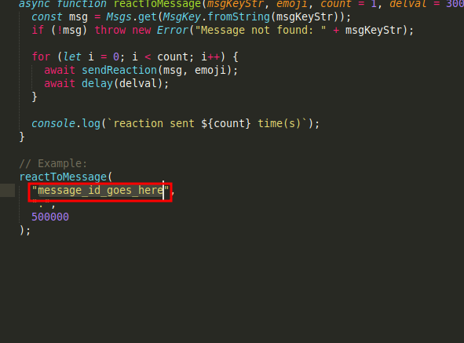

# "Careless Whisper" Proof of Concept

A Python based proof-of-concept for monitoring Round-Trip Time (RTT) of silent reaction delivery receipts in real-time messaging applications(Whatsapp), based on the research presented in [Careless Whisper: Exploiting Silent Delivery Receipts to Monitor Users on Mobile Instant Messengers](https://arxiv.org/abs/2411.11194) paper.

## Overview
This proof-of-concept implements the silent delivery receipt RTT monitoring technique described in the paper by injecting a javascript snippet that will monitor for the "message/reaction delivered" packets that whatsapp sent via websockets, the js snippet will listen post E2EE decryption.


## 🛠️ Prerequisites
- [uv](https://docs.astral.sh/uv/)
- [Python 3.13+](https://www.python.org/)

## Setup

1. Clone this repository:
```bash
git clone git@github.com:ahnaf505/careless-whisper-poc.git
cd careless-whisper-poc
```

2. Install Python dependencies:
```bash
uv sync
```

3. Get target message id
   Read [this section](#how-to-get-the-target-message-id) to get message id

## How to get the target message id
1. Login to [WhatsApp Web](https://web.whatsapp.com) on your browser
2. Open the Devtools

   

3. Open the target chat, and choose the message you want to target, this message has to be **sent by you** or else the target will receive a notification everytime the program react to the target message, which essentially defeats the point of silent monitoring  
   For example, in this case, the red rectangle marks the target message

   

4. Use the element selector tool to select the message

   

5. Find and copy the message id
   
   

6. Edit message id in inject.js

   
   
7. Continue with the setup!


## 🎮 Usage

## 🔮 Future Work


## 🏆 Citation

```
@article{gegenhuber2024careless,
  title={Careless Whisper: Exploiting Silent Delivery Receipts to Monitor Users on Mobile Instant Messengers},
  author={Gegenhuber, Gabriel K. and others},
  year={2024}
}
```


